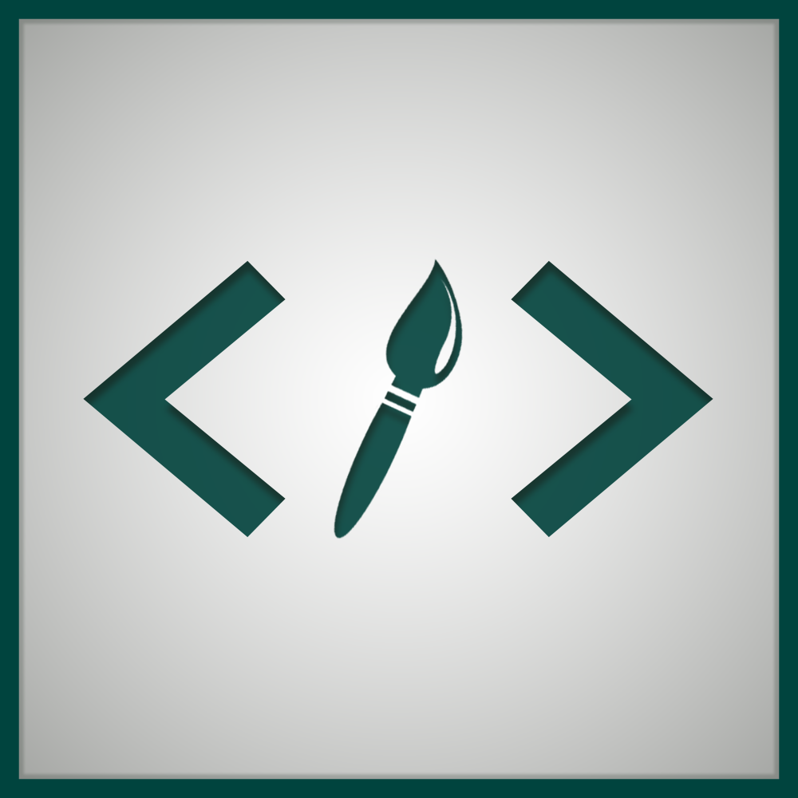

# PROTOTYPIST

<p align="center">  </p>

## Con [Docker](https://www.docker.com/what-docker)

Docker nos permite la ejecución de la app en un contenedor linux que posee las dependencias necesarias para ejecutar la aplicación. Al ser un contenedor, no tendremos acceso directo desde la app a nuestro disco duro, por lo que para probar algun proyecto concreto, debe copiarse, por ejemplo, a la carpeta `Demos/` antes de ejecutar la imagen de docker. Así al cargar un archivo desde la aplicación, podemos ir a `/app/Demos/` y cargar nuestro proyecto.

```shell
# Lo primero es construir la image docker. (Puede llevar un tiempo)
# Dentro de la carpeta Src/
docker build -t prototypist .
```

```shell
# Windows (Powershell y Xming o similares son necesarios).
xming -ac -multiwindow -clipboard  # Abre un servidor de X11.
docker run -it `
    -v "$((Get-Location).path):/app" `
    -e DISPLAY="$((Get-NetAdapter "vEthernet (DockerNAT)" | Get-NetIPAddress).IPAddress):0" `
    prototypist python3 /app/Src/Main.py
```

```shell
# Linux.
docker run -it \
    -v /tmp/.X11-unix:/tmp/.X11-unix \
    -v $(pwd):/app \
    -e DISPLAY=$DISPLAY \
    prototypist python3 /app/Src/Main.py
```

## Sin [Docker](https://www.docker.com/what-docker)

### Requisitos mínimos

- **Python >= 3.5**
  - [https://www.python.org/downloads/release/python-360/](https://www.python.org/downloads/release/python-360/)
- **PyQt5 *>=5.8***
  - [http://pyqt.sourceforge.net/Docs/PyQt5/](http://pyqt.sourceforge.net/Docs/PyQt5/)
- **lxml >= *3.7.3***
  - [http://lxml.de/index.html](http://lxml.de/index.html)
- **i18n *>=0.3.0***
  - [https://github.com/tuvistavie/python-i18n](https://github.com/tuvistavie/python-i18n)

Por lo que versiones antiguas de algunos sistemas puede queno sean compatibles con la aplicación, por no permitir la instalación de algunode dichos paquetes (*como Ubuntu 14.04 queno se puede instalar una versión superior a Python 3.4.3*)

### Instalación de dependencias

#### Windows

Desde PowerShell:

```powershell
Set-ExecutionPolicy RemoteSigned -scope CurrentUser
iex (new-object net.webclient).downloadstring('https://get.scoop.sh')
scoop install python
```

```powershell
pip3 install --upgrade pip
pip3 install PyQt5
pip3 install lxml
pip3 install python-i18n[YAML]
```

#### Ubuntu >= 16.04

```bash
sudo apt-get update && \

sudo apt-get install -y --no-install-recommends\
        python3 \
        python3-lxml \
        python3-pyqt5 \
        python3-pip \
        python3-setuptools

sudo pip3 install --upgrade pip
sudo pip3 install python-i18n[YAML]
```

Ante un mensaje similar a: “*D-Bus library appears to be incorrectly set up*”, ejecutar:

```bash
sudo apt-get install -y dbus
```

#### Mac

```bash
/usr/bin/ruby -e "$(curl -fsSL https://raw.githubusercontent.com/Homebrew/install/master/install)"
brew install python3
```

```bash
pip3 install --upgrade pip
pip3 install PyQt5
pip3 install lxml
pip3 install python-i18n[YAML]
```

### EJECUTAR

```shell
python3 Src/Main.py
```

### DEMO VIDEO
[](https://youtu.be/vnnRPrnEVkE)

